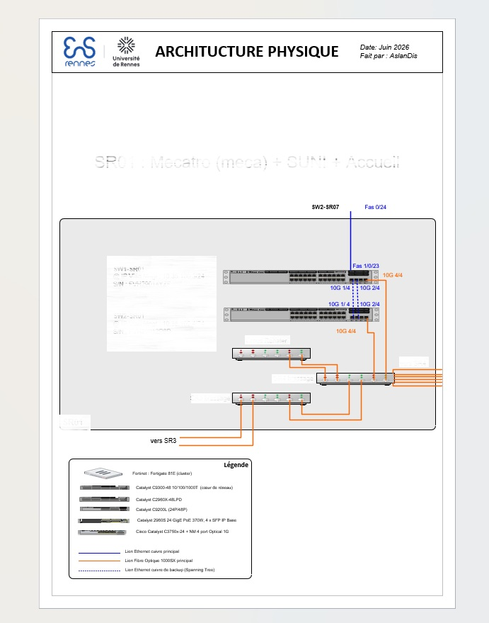
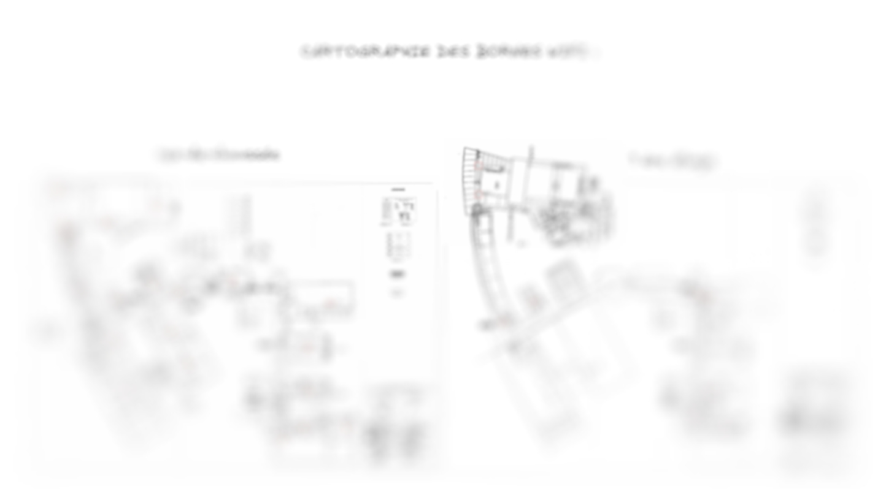

# Cartographie réseau et Wi-Fi – Missions de terrain

Ce dépôt retrace mes missions principales de la semaine au sein du service informatique :

- **Cartographie complète des 9 sous-répartiteurs** du réseau de l'ENS.
- **Cartographie de l'ensemble des bornes Wi-Fi** de l'établissement.

Ces missions m'ont permis de découvrir l'infrastructure sous un nouvel angle et d'acquérir une vision claire de l'architecture réseau, indispensable pour les interventions futures.

---

## Mission n°1 : Cartographie des sous-répartiteurs

### Contexte

Cette semaine, j'ai eu pour mission de localiser et documenter l'ensemble des **9 sous-répartiteurs** de l'établissement. L'objectif était double :

1. **Localiser physiquement** chaque sous-répartiteur.
2. **Créer une documentation** à afficher dans chaque local, expliquant clairement le schéma de câblage, afin de faciliter les interventions ultérieures.

### Un travail de fond

Un document de cartographie existait déjà (datant de 2024), mais il n'avait jamais été réellement mis en œuvre sur le terrain. Je l'ai récupéré pour m'aider à comprendre l'architecture, mais j'ai rapidement fait le choix de **repartir de zéro**.

Pourquoi ? Parce que le réseau a considérablement évolué depuis 2024 : de nouveaux équipements ont été ajoutés, et des liaisons ont été modifiées. Une mise à jour partielle n'aurait pas été fiable.

### Démarche sur le terrain

Je me suis donc déplacé physiquement dans **chacun des sous-répartiteurs** pour relever moi-même toutes les informations nécessaires. Cette approche "terrain" a été extrêmement enrichissante :

- Elle m'a permis de **visualiser concrètement** les connexions.
- J'ai pu **comprendre l'organisation générale** du réseau, qui peut sembler complexe au premier abord.
- Plus j'avançais, plus le puzzle s'assemblait et le fonctionnement devenait clair.

### Outils utilisés

- **Microsoft Visio** – pour la conception des schémas physiques et logiques.
- **Documentation Cisco** – pour valider les références et compatibilités.
- **GLPI** – pour assurer le suivi complet des équipements relevés.

### Exemple de production

Voici un aperçu d'un schéma réalisé (disponible intégralement sur mon OneDrive).  
*Note : plus de la moitié des informations ont été volontairement supprimées pour préserver l'intégrité du réseau de l'ENS.*

🔗 **Lien vers le schéma physique complet** :  
[Accéder au fichier OneDrive](https://siovhblyceebasch-my.sharepoint.com/:u:/g/personal/aslan_disgecmez_lycee-basch_fr/IQDnMuXrNWmDSYwhbuRunQ8TAWbcmU72jdjL1yH6bEQROdg?e=AOuozW)

---

## Mission n°2 : Cartographie des bornes Wi-Fi

### Contexte

Aucune cartographie précise des bornes Wi-Fi n'avait jamais été réalisée auparavant. On savait qu'elles existaient, mais sans plan clair, il était difficile de les identifier rapidement en cas de panne ou de maintenance.

### Démarche

J'ai parcouru **l'intégralité de l'établissement** avec mon ordinateur portable et un logiciel nommé **WiFiman**. Cet outil m'a permis de :

- Détecter les bornes Wi-Fi à proximité.
- Identifier leur **adresse MAC**.
- Mesurer la **puissance du signal** reçue en dBm.

### Livrable

À partir de ces relevés terrain, j'ai créé un **plan détaillé** indiquant pour chaque borne :

- Son **emplacement exact**.
- Son **identifiant**.
- Son **adresse MAC**.

Cette cartographie sera un outil précieux pour :

- Faciliter la gestion de l'infrastructure sans fil.
- Identifier rapidement les équipements défaillants.
- Simplifier les opérations de maintenance ou de dépannage.

### Outils utilisés

- **WiFiman** – pour la détection et les relevés.
- **Excalidraw** et **draw.io** – pour la conception des plans (ces solutions vont d'ailleurs bientôt être implémentées au sein de l'école).

### Aperçu

*Par souci de confidentialité, je ne peux pas révéler les plans complets de l'ENS. Voici un aperçu flouté de mon travail :*

---

## Ce que ces missions m'ont apporté

Au-delà des livrables, ces deux missions m'ont permis de :

- **Maîtriser l'architecture réseau** de l'ENS dans son ensemble.
- **Développer une méthodologie de cartographie** rigoureuse.
- **Gagner en autonomie** et en confiance sur le terrain.
- **Comprendre l'importance d'une documentation claire** pour la pérennité du système.

---

## Outils globaux utilisés

| Outil | Usage |
|-------|-------|
| Microsoft Visio | Schémas réseau |
| Cisco Documentation | Références techniques |
| GLPI | Gestion et suivi des équipements |
| WiFiman | Détection des bornes Wi-Fi |
| Excalidraw / draw.io | Plans de localisation |

---

## Auteur

**Disgecmez Aslan** – Technicien informatique  
*Compte rendu hebdomadaire – Service informatique*

---

*Documentation réalisée dans le cadre de mes missions à l'ENS.*
